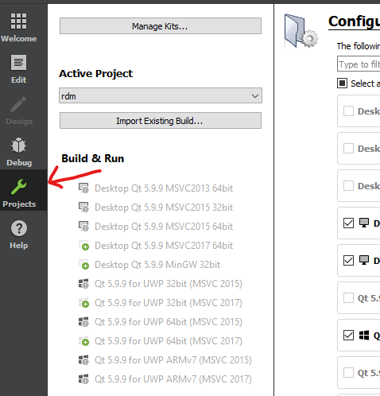

## Intro

As you may have found out, the documentation for building the Redis Desktop Manager isn't great.  This will (hopefully) allow you to build the project from source and distribute it to your team members.

These directions work for the 2019.5 version of the Redis Desktop Manager and are for building and installing RDM on Windows

## Step 1 - RDM documentation
Follow the directions located [here.](http://docs.redisdesktop.com/en/latest/install/#build-from-source)

Before you're able to build the project, you'll need to configure your project.  It should be as simple as clicking the project option on the left and then clicking configure project




If you can't get a successful build following these directions then there isn't any point in continuing on to the next step.

## Step 2 - Run QT application deployment

If you want to deploy this application or just run it without opening the QT compiler, you need to run the [QT Windows Deployment.](https://doc.qt.io/Qt-5/windows-deployment.html) This process will copy all the necessary files to you release folder.


Run the following command via command prompt:
```
<Path to QT install>\msvc2017_64\bin\windeployqt.exe --qmldir <Path to cloned repo>\src\qml\ <Path to cloned repo>\bin\windows\release\rdm.exe
```

## Step 3 - Run the program
At this point you should be able to run the program!  Just copy the release directory to whatever location you want and it should work.

## Debug tools
If you still can't get the program to run, try downloading the [Windows debug viewer.](https://docs.microsoft.com/en-us/sysinternals/downloads/debugview) Open this debugger before running rmd.exe and see what's erroring.

## Releases
[2019.5](/release/RedisDesktopManager-2019.5.7z)
